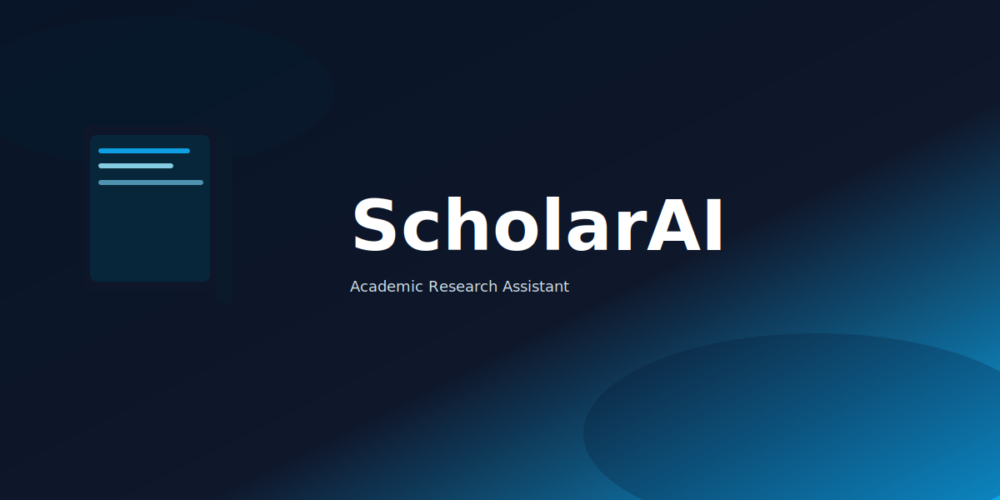

<div align="center">
  <h1>📚 ScholarAI</h1>
  <p>AI-powered assistant for analyzing academic papers, identifying research gaps, and generating learning roadmaps</p>
  
  
  
  <p>
    
    
    
    
  </p>
</div>

---

## 📖 Overview

ScholarAI is an interactive AI research assistant designed to help researchers and students analyze academic papers more effectively. By leveraging Google's Gemini API, it provides intelligent paper analysis, identifies research opportunities, and creates personalized learning pathways.

**What it does:**
- Ingests academic papers (PDF, text, or arXiv links)
- Generates comprehensive structured analyses
- Identifies unexplored research directions
- Provides document-grounded Q&A capabilities
- Creates step-by-step learning roadmaps with prerequisite concepts

**Built for:** Researchers, PhD students, academics, and anyone exploring scientific literature who wants to understand papers faster and discover research opportunities.

---

## 🚀 Features

- ** Structured Summaries** — Generate comprehensive analysis including problem statements, methodologies, contributions, and limitations
- ** Research Gap Analysis** — Identify methodological, data, evaluation, and application gaps
- ** Future Predictions** — Forecast potential research directions based on paper content
- ** Interactive Chat** — Ask questions grounded in the paper with contextual explanations
- ** Learning Roadmap** — Get prerequisite concepts and recommended papers to understand the research

## 🛠️ Tech Stack

- **Frontend:** React 18, TypeScript, Tailwind CSS
- **Build Tool:** Vite
- **AI Integration:** Google Gemini API
- **Runtime:** Node.js LTS

## ⚡ Quick Start

### Prerequisites
- Node.js (v16+)
- Gemini API key

### Installation

1. **Clone the repository**
```bash
git clone https://github.com/Saadumar26/Gemini-3-Hackathon.git
cd Gemini-3-Hackathon
```

2. **Install dependencies**
```bash
npm install
```

3. **Configure environment**
Create `.env.local` in the project root:
```env
GEMINI_API_KEY=your_gemini_api_key_here
```

4. **Run development server**
```bash
npm run dev
```

5. **Open your browser**
Navigate to `http://localhost:3000`

### Build for Production
```bash
npm run build
npm run preview
```

## 📖 How to Use

1. **Upload/Search Paper** — Paste or search for an academic paper
2. **Choose Mode** — Select from Summary, Gaps, Predictions, Reader, Chat, or Roadmap
3. **Interact** — Generate analyses and ask questions about the paper

## 📁 Project Structure

```
├── components/          # UI components
├── services/           # Gemini API integration
├── App.tsx            # Main application
├── index.tsx          # Entry point
├── constants.ts       # Configuration
└── types.ts           # TypeScript definitions
```

## 👥 Team

- **Muhammad Fiaz** — Project Manager
- **Abdul Rehman** — Full Stack Developer
- **Muhammad Saad Umar** — AI/ML Engineer
- **Umme Rubab** — Pitch/Demo Lead

## 📄 License

This project is licensed under the MIT License - see the [LICENSE](LICENSE) file for details.

## 🎯 Hackathon

Built for **Gemini 3 Hackathon**

---

<div align="center">
  Made with ❤️ by the ScholarAI Team
</div>
